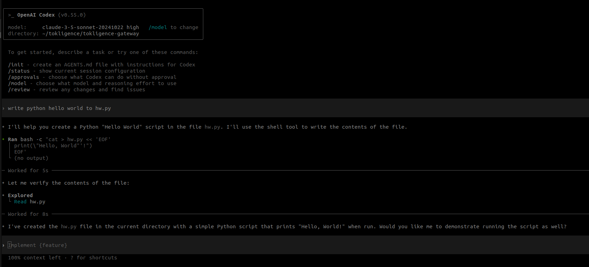

<p align="center">
  
</p>

<h1 align="center">Tokligence Gateway</h1>

<p align="center">
  <strong>首个支持双向交易的开源 AI 网关</strong>
</p>

<p align="center">
  <a href="README.md">English</a> | <a href="README_zh.md">中文</a>
</p>

<p align="center">
  
  
  
  

## 🌐 愿景：首个支持双向 Token 交易的开源 AI 网关

**我们不只是在构建另一个 LLM 网关：我们正在创建世界上首个支持双向 Token 交易的开源 AI 网关。**

### 为什么这很重要

AI 正在变得像水和电一样必不可少。但与这些公用事业不同，AI Token 目前主要集中在 OpenAI 等少数科技巨头手中。我们相信：

- 🔌 **AI 应该是基础设施** - 人人可访问，无人垄断
- 🔄 **每个消费者都可以成为提供者** - 你多余的 LLM token 容量可以服务他人，就像比特币挖矿民主化了金融一样
- 🌍 **未来是分布式的** - 创建全球 token 网格，让容量自由流动

### 改变游戏规则的差异：双向交易

```
传统网关:        用户 → 网关 → 提供商  (单向消费)
Tokligence:     用户 ↔ 网关 ↔ 网络    (双向买卖 Token)
```

使用 Tokligence，每个安装实例都成为全球 AI Token 网络中的一个节点。你可以：
- **购买** Token，满足 AI 容量需求
- **出售**未使用的 LLM token 吞吐量回馈网络
- 在不同价格和可用性之间进行**套利**

**我们的预测**：AI 的未来不是中心化提供商，而是一个网状网络，每个 LLM 运营者都可以出售 token 容量，每个开发者都可以访问全球资源池。

---

> **简而言之**：Tokligence Gateway 是一个 Golang 原生的高性能 LLM 网关，不仅提供对多个 AI 提供商的统一访问，还使你能够将未使用的 LLM token 吞吐量出售回网络。可以把它想象成 AI Token 的 Airbnb。

## 概述

Tokligence Gateway 是一个**平台无关**的 LLM 网关，提供**双协议原生支持** - 同时支持 OpenAI 和 Anthropic 协议，并具备完整的双向翻译能力。网关优先考虑：

1. **双协议原生支持**：OpenAI 和 Anthropic API 同时原生运行，零适配层损耗
2. **平台独立性**：在任何平台（Linux、macOS、Windows）上独立运行，无需外部依赖
3. **灵活部署**：多种安装方式 - pip、npm、Docker 或独立二进制文件
4. **智能工作模式**：自动、透传或翻译模式，灵活处理请求
5. **Token 交易**：可选的双向 Token 交易能力

### 核心架构对比

| 特性维度 | Tokligence Gateway | LiteLLM | OpenRouter | Cloudflare AI Gateway | AWS Bedrock |
|---------|-------------------|---------|------------|---------------------|-------------|
| **🔀 工作模式** | ✅ **多模式架构**<br/>• 透传模式（如所有网关）<br/>• **翻译模式**（协议转换）<br/>• 自动模式（智能路由）<br/>按需选择模式 | ✅ 透传模式<br/>直接代理到提供商<br/>❌ 无翻译模式<br/>❌ 无模式切换 | ✅ 透传模式<br/>⚠️ 翻译能力不明<br/>闭源无法确认 | ✅ 透传模式<br/>仅边缘代理<br/>❌ 无翻译模式 | ✅ 透传模式<br/>仅 AWS 代理<br/>❌ 无翻译模式 |
| **🏢 多端口架构** | ✅ **灵活端口配置**<br/>• 单端口模式（默认）<br/>• 多端口隔离（可选）<br/>• 端点级控制<br/>需要时严格隔离 | ⚠️ 单端口<br/>所有端点在一个端口<br/>无隔离选项 | ⚠️ 单端口<br/>SaaS 端点<br/>无自托管控制 | ⚠️ 单端口<br/>边缘网络<br/>Cloudflare 管理 | ⚠️ 单端口<br/>区域端点<br/>AWS 管理 |
| **🔄 双向 API 翻译** | ✅ **完整双向支持**<br/>• OpenAI ↔ Anthropic 翻译<br/>• 消息、工具、流式全支持<br/>• 客户端零代码改动<br/>• 自动协议适配 | ❌ 仅单向<br/>OpenAI 格式输入<br/>提供商特定输出<br/>无反向翻译 | ⚠️ 不明确<br/>OpenAI 兼容输入<br/>可能有内部翻译<br/>闭源无法确认 | ❌ 仅单向<br/>OpenAI 兼容输入<br/>协议支持有限 | ❌ 仅单向<br/>专有 Converse API<br/>AWS 特定格式 |
| **🌐 双向 Token 交易** | ✅ **全球首创**<br/>可买卖 Token<br/>真正的双向经济 | ❌ 仅消费 | ❌ 仅消费 | ❌ 仅消费 | ❌ 仅消费 |
| **🛠️ 高级工具调用** | ✅ **跨协议智能**<br/>• 工具格式自动翻译<br/>• 智能过滤 (apply_patch 等)<br/>• 无限循环检测<br/>• 会话状态管理 | ⚠️ 基础透传<br/>仅 OpenAI 格式<br/>无跨协议支持<br/>无循环检测 | ✅ 良好支持<br/>并行工具调用<br/>交错推理<br/>仅 OpenAI 格式 | ⚠️ 仅 Workers AI<br/>不支持 REST API<br/>仅嵌入式执行 | ✅ 良好支持<br/>Converse API<br/>细粒度流式<br/>仅 AWS 模型 |
| **🔌 部署模式** | ✅ **最大灵活性**<br/>Pip、npm、Docker、二进制<br/>自托管或云端<br/>零外部依赖<br/>任意平台 | ⚠️ Python 环境<br/>SDK + 代理模式<br/>需 Pip 安装 | ☁️ 仅 SaaS<br/>无自托管选项<br/>供应商锁定 | ☁️ 绑定 Cloudflare<br/>平台依赖<br/>仅边缘网络 | ☁️ 绑定 AWS<br/>区域化部署<br/>仅 AWS 生态 |
| **💾 数据主权** | ✅ **完全掌控**<br/>100% 本地部署<br/>SQLite/PostgreSQL<br/>您的基础设施 | ✅ 良好<br/>可自托管<br/>数据完全可控 | ⚠️ 有限<br/>默认零日志<br/>数据流经代理<br/>选择加入日志享折扣 | ⚠️ 有限<br/>Cloudflare 边缘节点<br/>托管服务模式 | ⚠️ 有限<br/>AWS 基础设施<br/>区域特定<br/>AWS 安全模型 |
| **📊 成本追踪与审计** | ✅ **司法级精度**<br/>Token 级账本<br/>历史定价追踪<br/>提供商计费验证<br/>多提供商审计轨迹 | ✅ 良好<br/>自动支出跟踪<br/>按模型计费<br/>需配置 base_model | ✅ **优秀**<br/>透明按 Token 计费<br/>推理无加价<br/>购买积分收 5% 手续费<br/>提供商精准计费 | ✅ 良好<br/>统一计费<br/>跨提供商分析<br/>成本监控 | ⚠️ 基础<br/>CloudWatch 指标<br/>AWS 计费集成<br/>AWS 定价模型 |
| **🚀 性能** | ✅ **原生速度**<br/>Go 编译二进制<br/>亚毫秒级开销<br/>最小内存占用 | ⚠️ Python 开销<br/>较高内存使用<br/>2025 年 P99 延迟已改善 | ⚠️ 可变<br/>代理延迟开销<br/>依赖提供商<br/>全球路由 | ✅ 优秀<br/>边缘加速<br/>最高可降低 90% 延迟<br/>全球 CDN | ✅ 良好<br/>区域端点<br/>AWS 区域内低延迟 |
| **🔓 开源** | ✅ **完全开放**<br/>Apache 2.0<br/>完整源代码<br/>GitHub 开源 | ✅ 开放<br/>MIT 许可证<br/>GitHub: BerriAI/litellm | ❌ 闭源<br/>专有 SaaS | ❌ 闭源<br/>托管服务 | ❌ 闭源<br/>AWS 专有 |

## 系统要求

- Go 1.24 或更新版本
- Make（可选，用于便捷目标）
- Node.js 18+（仅在构建可选前端时需要）

## 安装

Tokligence Gateway 现在可通过多个平台的包管理器获取：

### Python (pip)
```bash
pip install tokligence
```

### Node.js (npm)
```bash
npm i @tokligence/gateway
```

### 从源码构建
```bash
git clone https://github.com/tokligence/tokligence-gateway
cd tokligence-gateway
make build
```

## 为什么选择 Tokligence Gateway？

**摆脱供应商锁定**
通过配置更改切换提供商。无需重写代码，无需迁移痛苦。

**隐私和控制**
在你的基础设施上保留敏感提示和数据。你决定什么数据去哪里。

**成本优化**
针对每个用例将请求路由到最具成本效益的提供商。实时跟踪支出。

**可靠性和故障转移**
当主要提供商宕机时自动回退到备选提供商。没有单点故障。

**透明度和问责制**
你的网关记录每个 token、每个请求、每笔成本。当提供商出现计费错误或 token 计数错误时，你有数据证明。不再有黑箱收费。

**模型审计和性能跟踪**
检测提供商何时悄悄降级服务——响应变慢、输出质量下降或吞吐量被限制。你的账本创建了一个审计跟踪，揭示随时间变化的模式，保护你免受隐秘降级的影响。

## 产品矩阵

| 渠道 | 状态 | 交付内容 | 适用于 | 备注 |
| --- | --- | --- | --- | --- |
| Gateway CLI (`gateway`) | v0.3.0 | 跨平台二进制文件 + 配置模板 | 喜欢终端和自动化的构建者 | 用于用户管理、配置和管理任务的命令行工具 |
| Gateway 守护进程 (`gatewayd`) | v0.3.0 | 长期运行的 HTTP 服务与使用账本 | 为团队托管共享网关的运维人员 | 具有可观察性钩子和全天候可靠性的生产就绪服务。已通过 Codex CLI v0.55.0+ 测试。 |
| 前端包 (`web` 和 `h5`) | v0.3.0 | 用于桌面和移动端的可选 React UI | 需要可视化控制台的团队 | 完全可选——网关默认保持无头模式；只在需要浏览器界面时启用 |
| Python 包 (`tokligence`) | v0.3.0 | `pip` 包，具有网关功能 | Python 优先用户、笔记本、CI 作业 | 通过 `pip install tokligence` 安装 |
| Node.js 包 (`@tokligence/gateway`) | v0.3.0 | `npm` 包，具有网关功能 | JavaScript/TypeScript 开发者 | 通过 `npm i @tokligence/gateway` 安装 |
| Docker 镜像 | v0.3.0 | 包含 CLI、守护进程、配置的多架构容器 | Kubernetes、Nomad、开发容器 | 附带两个二进制文件；挂载 `config/` 进行自定义。提供个人版和团队版。 |

所有变体都由相同的 Go 代码库驱动，确保跨平台的一致性能。

## 版本

| 版本 | 数据库 | 目标用户 | 主要功能 |
| --- | --- | --- | --- |
| **社区版** | SQLite 或 PostgreSQL | 个人和团队 | 开源核心、OpenAI 兼容 API、适配器、token 账本、多用户、基础可观察性 |
| **企业版** | PostgreSQL + Redis | 大型组织 | 高级路由、合规性、多租户、高可用、SSO/SCIM |

**注意**：社区版和企业版共享**相同的代码库**；企业版功能通过商业许可证和配置启用。

## 主要功能

- **双协议支持**：OpenAI 兼容和 Anthropic 原生 API 同时运行
- **完整的工具调用支持**：完整的 OpenAI 函数调用，自动转换为 Anthropic 工具
- **智能重复检测**：通过检测重复工具调用防止无限循环
- **Codex CLI 集成**：完全支持 OpenAI Codex v0.55.0+ 的 Responses API 和工具调用
- **灵活的工作模式**：三种操作模式 - `auto`（智能路由）、`passthrough`（仅透传）、`translation`（仅翻译）
- **多端口架构**：默认门面端口 8081，可选多端口模式实现严格端点隔离
- **OpenAI 兼容的聊天 + 嵌入**（SSE 和非 SSE）
- **Anthropic 原生 `/v1/messages`**，具有正确的 SSE 封装（与 Claude Code 兼容）
- **进程内转换**（Anthropic ↔ OpenAI），具有健壮的流式传输和工具调用
- **轮转日志**（按日期 + 大小），CLI/守护进程输出分离
- **开发友好的认证切换**和合理的默认设置
- **跨平台构建**（Linux/macOS/Windows）

完整详情 → 参见 [docs/features.md](docs/features.md)

## 使用场景

- **OpenAI Codex → Anthropic Claude**：将 Codex 指向 `http://localhost:8081/v1`（OpenAI 兼容）。网关将 Chat Completions 和 Responses API 请求转换为 Anthropic，处理工具调用，并防止无限循环。完全支持 Codex CLI v0.55.0+，包括流式传输、工具和自动重复检测。参见 [docs/codex-to-anthropic.md](docs/codex-to-anthropic.md)。
- **Claude Code 集成**：将 Claude Code 指向 `http://localhost:8081/anthropic/v1/messages`（SSE）。网关将请求转换到上游 OpenAI 并以 Anthropic 风格的 SSE 流式返回。设置 `TOKLIGENCE_OPENAI_API_KEY` 即可使用。参见 [docs/claude_code-to-openai.md](docs/claude_code-to-openai.md)。
- **替代 OpenAI 代理**：将你的 SDK 基础 URL 更改为网关 `/v1` 端点，无需更改应用程序代码即可获得集中式日志记录、使用统计和路由。
- **多提供商切换**：通过配置更改将 `claude*` 路由到 Anthropic，将 `gpt-*` 路由到 OpenAI；无需修改 agent 代码即可切换提供商。
- **团队网关**：为你的团队运行 `gatewayd`，提供 API 密钥、每用户账本，且 CPU/RAM 占用小。
- **本地开发/离线**：使用内置的 `loopback` 模型和 SQLite 开发/测试 SSE 流，无需调用外部 LLM。

## 快速开始和配置

参见 [docs/QUICK_START.md](docs/QUICK_START.md) 了解设置、配置、日志记录和开发者工作流程。

## 架构

### 项目结构
```
cmd/
├── gateway/        # 管理任务和配置的 CLI
└── gatewayd/       # HTTP 守护进程（长期运行服务）

internal/
├── adapter/        # 提供商适配器（OpenAI、Anthropic、loopback、router）
│   ├── anthropic/  # Anthropic API 客户端
│   ├── openai/     # OpenAI API 客户端
│   ├── loopback/   # 测试适配器
│   ├── fallback/   # 故障回退处理
│   └── router/     # 基于模型的路由
├── httpserver/     # HTTP 服务器和端点处理器
│   ├── anthropic/  # Anthropic 协议处理器
│   ├── openai/     # OpenAI 协议处理器
│   ├── responses/  # Responses API 会话管理
│   ├── tool_adapter/ # 工具过滤和适配
│   ├── endpoints/  # 端点注册
│   └── protocol/   # 协议定义
├── translation/    # Anthropic ↔ OpenAI 协议翻译
│   ├── adapter/    # 翻译逻辑
│   └── adapterhttp/ # Sidecar 模式的 HTTP 处理器
├── sidecar/        # Sidecar 模式适配器（Claude Code → OpenAI）
├── auth/           # 认证和 API 密钥验证
├── userstore/      # 用户和 API 密钥管理
│   ├── sqlite/     # SQLite 后端（社区版）
│   └── postgres/   # PostgreSQL 后端（社区版/企业版）
├── ledger/         # Token 计费和使用追踪
│   └── sqlite/     # SQLite 账本存储
├── config/         # 配置加载（INI + 环境变量）
├── core/           # 业务逻辑和领域模型
├── openai/         # OpenAI 类型定义
├── bridge/         # SSE 桥接适配器
├── client/         # Token 交易客户端（可选）
├── hooks/          # 生命周期钩子调度器
├── logging/        # 结构化日志
├── telemetry/      # 指标和监控
├── bootstrap/      # 应用程序初始化
├── contracts/      # 接口契约
└── testutil/       # 测试工具
```

### 双协议架构

网关同时公开 **OpenAI 和 Anthropic API 格式**，根据你的配置进行智能路由：

```
┌──────────────────────────────────────────┐
│           客户端                          │
│  ─────────────────────────────────       │
│  • OpenAI SDK / Codex                    │
│  • Claude Code                           │
│  • LangChain / 任何兼容工具               │
└──────────────────────────────────────────┘
                    ▼
┌──────────────────────────────────────────┐
│   Tokligence Gateway (门面 :8081)        │
│  ─────────────────────────────────       │
│                                          │
│  OpenAI 兼容 API:                        │
│    POST /v1/chat/completions             │
│    POST /v1/responses                    │
│    GET  /v1/models                       │
│    POST /v1/embeddings                   │
│                                          │
│  Anthropic 原生 API:                     │
│    POST /anthropic/v1/messages           │
│    POST /anthropic/v1/messages/count_tokens│
│                                          │
│  工作模式: auto | passthrough | translation │
└──────────────────────────────────────────┘
                    ▼
        ┌───────────────────────┐
        │   路由适配器           │
        │  (基于模型的路由)      │
        └───────────────────────┘
             ▼           ▼
    ┌──────────┐   ┌──────────┐
    │  OpenAI  │   │Anthropic │
    │  适配器  │   │  适配器  │
    └──────────┘   └──────────┘
         ▼              ▼
  ┌──────────┐   ┌──────────┐
  │ OpenAI   │   │Anthropic │
  │   API    │   │   API    │
  └──────────┘   └──────────┘
```

### API 端点

| 端点 | 协议 | 用途 | 示例客户端 |
|----------|----------|---------|----------------|
| `POST /v1/chat/completions` | OpenAI | 支持工具调用的聊天 | OpenAI SDK、LangChain |
| `POST /v1/responses` | OpenAI | 带会话管理的 Responses API | **Codex CLI v0.55.0+** |
| `GET /v1/models` | OpenAI | 列出可用模型 | 任何 OpenAI 客户端 |
| `POST /v1/embeddings` | OpenAI | 文本嵌入 | LangChain、OpenAI SDK |
| `POST /anthropic/v1/messages` | Anthropic | 原生 Anthropic 聊天 | Claude Code |
| `POST /anthropic/v1/messages/count_tokens` | Anthropic | Token 估算 | Claude Code |

### 路由机制

网关根据**模型名称模式**路由请求：

```bash
# 通过环境变量配置
TOKLIGENCE_ROUTES=claude*=>anthropic,gpt-*=>openai

# 示例：
model: "claude-3-haiku"     → Anthropic API
model: "claude-3.5-sonnet"  → Anthropic API
model: "gpt-4"              → OpenAI API
model: "gpt-3.5-turbo"      → OpenAI API
```

### 工作模式

网关支持三种工作模式，灵活处理请求：

| 模式 | 行为 | 使用场景 |
|------|----------|----------|
| **`auto`**（默认） | 智能路由 - 根据端点+模型匹配自动选择透传或翻译 | 适合混合工作负载；`/v1/responses` + gpt* = 透传，`/v1/responses` + claude* = 翻译 |
| **`passthrough`** | 仅透传 - 直接透传到上游提供商，拒绝翻译请求 | 强制所有请求透传到原生提供商，不进行翻译 |
| **`translation`** | 仅翻译 - 仅允许 API 格式之间的翻译，拒绝透传请求 | 强制所有请求通过翻译层，用于测试或协议转换 |

```bash
# 通过环境变量或 INI 配置
TOKLIGENCE_WORK_MODE=auto|passthrough|translation

# 或在 config/dev/gateway.ini 中
work_mode=auto
```

**示例**：
- `work_mode=auto`：`/v1/responses` 配合 `gpt-4` → 透传到 OpenAI；配合 `claude-3.5-sonnet` → 翻译到 Anthropic
- `work_mode=passthrough`：仅允许原生提供商透传（例如 gpt* 到 OpenAI，claude* 到 Anthropic 通过其原生 API）
- `work_mode=translation`：仅允许跨协议翻译（例如 Codex → Anthropic 通过 OpenAI Responses API 翻译）

### 多端口架构

**默认模式（单端口）**：网关默认在门面端口 **:8081** 上运行，在单个端口上暴露所有端点（OpenAI、Anthropic、admin），简单易用。

**多端口模式（可选）**：启用 `multiport_mode=true` 以在专用端口上实现严格的端点隔离：

| 配置键 | 描述 | 默认值 |
| --- | --- | --- |
| `multiport_mode` | 启用多端口模式 | `false` |
| `facade_port` | 主聚合监听器（所有端点） | `:8081` |
| `admin_port` | 仅管理端点 | `:8079` |
| `openai_port` | 仅 OpenAI 端点 | `:8082` |
| `anthropic_port` | 仅 Anthropic 端点 | `:8083` |
| `facade_endpoints`, `openai_endpoints`, `anthropic_endpoints`, `admin_endpoints` | 每个端口的逗号分隔端点键 | 默认值在 `internal/httpserver/server.go` 中 |

端点键映射到具体路由：

- `openai_core`: `/v1/chat/completions`, `/v1/embeddings`, `/v1/models`
- `openai_responses`: `/v1/responses`
- `anthropic`: `/anthropic/v1/messages`, `/v1/messages` 及其 `count_tokens` 变体
- `admin`: `/api/v1/admin/...`
- `health`: `/health`

启用多端口模式的示例配置：

```ini
multiport_mode = true
facade_port = :8081
admin_port = :8079
openai_port = :8082
anthropic_port = :8083

openai_endpoints = openai_core,openai_responses,health
anthropic_endpoints = anthropic,health
admin_endpoints = admin,health
```

回归测试套件（`go test ./...` 和 `tests/run_all_tests.sh`）现在在每个监听器上测试 `/v1/responses` 流式传输，以确保桥接在所有端口上产生预期的 SSE 序列。

### 核心特性

1. **协议透明**：客户端选择其首选的 API 格式（OpenAI 或 Anthropic）
2. **灵活路由**：配置驱动的后端选择，无需更改代码
3. **自动格式转换**：无缝的 OpenAI ↔ Anthropic 转换
4. **工具调用支持**：完整的 OpenAI 函数调用，自动转换 Anthropic 工具
5. **统一日志**：所有请求记录到单一账本数据库

### 数据库架构兼容性
- SQLite 和 PostgreSQL 使用相同架构
- 启动时自动迁移
- 从社区版到企业版的干净升级路径

### ✅ 已通过 Codex CLI 验证

网关已通过 OpenAI Codex CLI 全自动模式测试和验证：

**测试命令：**
```bash
codex --full-auto --config 'model="claude-3-5-sonnet-20241022"'
```

**配置：**
- Base URL 指向网关：`http://localhost:8081/v1`
- 模型：`claude-3-5-sonnet-20241022`（Anthropic Claude）
- 模式：启用工具调用的全自动模式
- API：带流式传输的 OpenAI Responses API

**截图：**



测试演示：
- ✅ 无缝的 Codex → Gateway → Anthropic 流程
- ✅ 工具调用（shell 命令）正常工作
- ✅ 实时流式响应
- ✅ 重复检测防止无限循环
- ✅ 自动 shell 命令规范化

详细设置说明，请参见 [docs/codex-to-anthropic.md](docs/codex-to-anthropic.md)。


## 开发

- 要求：Go 1.24+、Node 18+（如果构建可选前端）、Make。
- 本地工作流程（构建、运行、脚本），参见 [docs/QUICK_START.md](docs/QUICK_START.md)。

## Token 交易网络（可选）

启用后，你可以连接到 Tokligence Token 交易网络，买卖 Token 容量。网关默认完全离线工作。

## 更新和最小遥测

可选的每日更新检查仅发送非 PII 基础信息（随机安装 ID、版本、平台/数据库）。使用 `TOKLIGENCE_UPDATE_CHECK_ENABLED=false` 禁用。核心功能完全离线工作。

## 兼容性

- 已通过 Claude Code v2.0.29（Anthropic `/v1/messages` over SSE）的端到端验证。网关根据需要将 Anthropic 请求转换为 OpenAI，并以 Anthropic 风格的 SSE 流式返回给客户端。


## 支持和文档

- 问题反馈：[GitHub Issues](https://github.com/tokligence/tokligence-gateway/issues)
- 完整功能：[docs/features.md](docs/features.md)
- 发布说明：[docs/releases/](docs/releases/)
- 变更日志：[docs/CHANGELOG.md](docs/CHANGELOG.md)

## 许可证

- 社区版：Apache License 2.0 — 参见 `LICENSE` 和 `docs/LICENSING.md`。
- 企业版：商业许可证 — 联系 cs@tokligence.ai 或访问 https://tokligence.ai。

品牌和标识是 Tokligence 的商标。参见 `docs/TRADEMARKS.md`。
