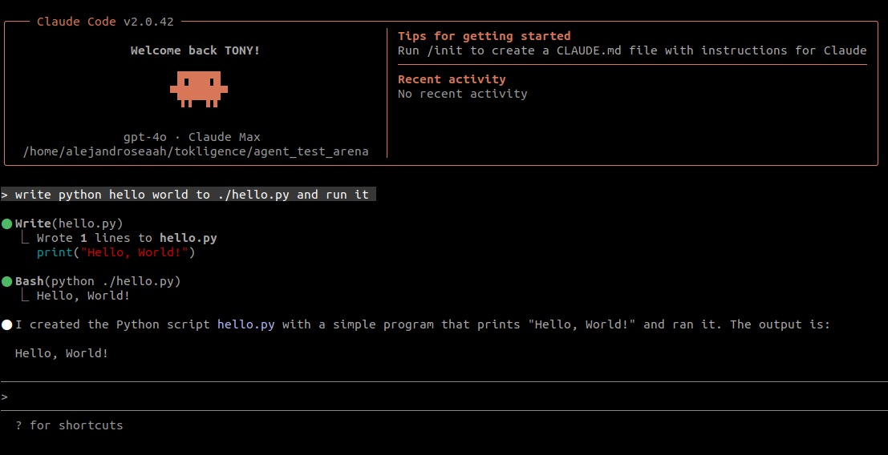

<p align="center">
  
</p>

<h1 align="center">Tokligence Gateway</h1>

<p align="center">
  <strong>首个支持双向交易的开源 AI 网关</strong>
</p>

<p align="center">
  <a href="README.md">English</a> | <a href="README_zh.md">中文</a>
</p>

<p align="center">
  
  
  
  
</p>

<p align="center">
  <a href="https://github.com/tokligence/tokligence-gateway/actions/workflows/ci.yml">
    
  </a>
</p>

## 🌐 愿景

**我们不只是在构建另一个 LLM 网关：我们正在创建一个支持双向 Token 交易的开源 AI 网关。**

### 为什么这很重要

AI 正在变得像水电一样必不可少。然而，LLM Token 供应能力不应该只集中在像 OpenAI 等少数科技巨头手中。我们希望：

- 🔌 **AI 应该是基础设施** - 开放透明，不被少数平台控制
- 🔄 **每个消费者都能成为提供者** - 你多余的 LLM token 吞吐量可以服务他人，就像比特币挖矿让金融民主化一样
- 🌍 **未来是分布式的** - 构建全球去中心化token 交易市场，普通人也可以成为token提供方

### 改变游戏规则的差异：双向交易

```
传统网关:        用户 → 网关 → 提供商  (单向消费)
Tokligence:     用户（拥有GPU和自托管LLM的） ↔ 网关 ↔ Token交易市场    (双向买卖 Token)
```

使用 Tokligence，每个安装实例都成为全球 AI Token 网络中的一个节点。你可以：
- **购买** Token，满足 AI 需求
- **出售**未使用的 LLM token 吞吐量给token市场
- 在不同价格和可用性之间进行**套利**

**我们的预测**：AI 的未来不是中心化提供商，而是一个网状网络，每个 自托管LLM的 企业或个人都可以出售剩余 token 吞吐量。

---

> **简而言之**：Tokligence Gateway 是一个 Golang 原生的高性能 LLM 网关，不仅提供对多个 LLM 提供商的统一访问，还使你能够将未使用的 LLM token 吞吐量出售到市场上。可以把它想象成 AI Token 的 Airbnb。

## 概述

Tokligence Gateway 是一个**平台无关**的 LLM 网关，提供**双协议原生支持** - 同时支持 OpenAI 和 Anthropic 协议，并具备完整的双向翻译能力。网关优先考虑：

1. **双协议原生支持**：OpenAI 和 Anthropic API 同时原生运行，零适配层损耗
2. **平台独立性**：在任何平台（Linux、macOS、Windows）上独立运行，无需外部依赖
3. **灵活部署**：多种安装方式 - pip、npm、Docker 或独立二进制文件
4. **智能工作模式**：自动、透传或翻译模式，灵活处理请求
5. **Token 交易**：可选的双向 Token 交易能力

## ⚡ 性能表现

Tokligence Gateway 以极低的资源占用提供卓越的性能表现。

### 与 LiteLLM 的性能对比

基于 [LiteLLM 官方基准测试](https://docs.litellm.ai/docs/benchmarks)（4 CPU，8GB RAM，回环测试）：

| 指标 | LiteLLM<br/>（4 实例） | Tokligence<br/>（1 实例） | 性能提升 |
|------|----------------------|--------------------------|---------|
| **吞吐量** | 1,170 RPS | **7,700+ RPS** | **6.6倍** ✨ |
| **中位延迟** | 100 ms | 3 ms | **33倍** ⚡ |
| **P95 延迟** | 150 ms | 10-32 ms | **5-15倍** 🚀 |
| **P99 延迟** | 240 ms | 150 ms | **1.6倍** |
| **所需实例数** | 4 | **1** | **减少 75%** 💰 |
| **峰值错误率** | 未报告 | **0%** | 极佳的稳定性 |

**核心亮点**：
- 单实例实现 **6.6倍吞吐量**，对比 LiteLLM 的 4 实例部署
- 简单请求可达**亚毫秒级延迟**（最低 0.18ms）
- 在最大吞吐量（7,700 RPS）下**零错误率**
- **性能下限**：测试在开发机器（AMD Ryzen 9 3950X）上进行，期间有多任务并行运行——生产环境可能达到更高性能

查看 [scripts/benchmark/](scripts/benchmark/) 了解完整测试方法论和复现步骤。

### 核心功能对比

| 特性维度 | Tokligence Gateway | LiteLLM | OpenRouter | Cloudflare AI Gateway | AWS Bedrock |
|---------|-------------------|---------|------------|-----------------------|-------------|
| **协议与翻译** | 支持 OpenAI ↔ Anthropic 双向翻译，双协议原生端点。 | 以 OpenAI 格式为入口，路由到多家提供商。 | 以 OpenAI 风格接口对多家模型做内部转换。 | 标准化多家提供商的 OpenAI 风格请求。 | 通过 Converse API 在 AWS 内统一 Bedrock 模型调用。 |
| **工作模式与路由** | 模型优先的 Auto 模式，先选提供商再选协议。 | 支持按成本、延迟、权重等灵活路由策略。 | 在托管网关内自动做路由和回退。 | 依托边缘网络提供地理 / A/B 路由。 | 与 AWS 区域和服务紧密耦合的路由。 |
| **端口与隔离** | 默认单端口，可选多端口严格隔离。 | 单进程代理，通过配置做逻辑隔离。 | 单一 SaaS 端点。 | 由 Cloudflare 管理的一组边缘端点。 | 由 AWS 管理的区域化服务端点。 |
| **客户端与 SDK** | 兼容 OpenAI / Anthropic SDK（含 Codex、Claude Code），无需改动客户端代码。 | 适合使用 OpenAI SDK | 适合使用 OpenAI SDK | 适合已在 Cloudflare 边缘终止流量的应用。 | 适合使用 AWS SDK、以 Bedrock 为主的架构。 |
| **性能与运行开销** | Go 编译二进制，翻译路径开销低。 | Python 服务，运行时开销相对更高。 | 增加一跳网络代理，延迟取决于上游。 | 在边缘运行，面向全球的端到端延迟较低。 | 针对 AWS 区域内流量做了优化。 |
| **部署与控制** | 自托管开源，支持 Docker、二进制、pip、npm。 | 自托管的 Python 服务，可与现有应用一起部署。 | 完全托管的 SaaS，无需自建基础设施。 | 作为 Cloudflare 平台的一部分运作。 | 作为 AWS 账号内的托管服务运行。 |
| **账本与审计** | 内置 Token 账本，便于做使用与审计追踪。 | 可通过服务指标查看用量。 | 在控制台中提供计费和用量分析。 | 通过 Cloudflare 提供流量与分析能力。 | 通过 CloudWatch 和计费报表查看用量。 |
| **Token 交易市场** | 面向双边 Token 交易市场设计，可买入或出售闲置的 LLM 吞吐量。 | 仅按调用消费，不支持 Token 交易市场。 | 仅按调用消费，不支持 Token 交易市场。 | 仅按调用消费，不支持 Token 交易市场。 | 仅按调用消费，不支持 Token 交易市场。 |
| **开源属性** | Apache‑2.0 开源。 | MIT 开源。 | 闭源 SaaS。 | 闭源托管服务。 | 闭源云服务。 |

## 系统要求

- Go 1.24 或更新版本
- Make（可选，用于便捷目标）
- Node.js 18+（仅在构建可选前端时需要）

## 安装

Tokligence Gateway 现在可通过多个平台的包管理器获取：

### Python (pip)
```bash
pip install tokligence
```

### Node.js (npm)
```bash
npm i @tokligence/gateway
```

### 从源码构建
```bash
git clone https://github.com/tokligence/tokligence-gateway
cd tokligence-gateway
make build
```

## 为什么选择 Tokligence Gateway？

**摆脱供应商锁定**
通过配置更改切换提供商。无需重写代码，无需迁移痛苦。

**隐私和控制**
在你的基础设施上保留敏感提示和数据。你决定什么数据去哪里。

**成本优化**
针对每个用例将请求路由到最具成本效益的提供商。实时跟踪支出。

**可靠性和故障转移**
当主要提供商宕机时自动回退到备选提供商。没有单点故障。

**透明度和问责制**
你的网关记录每个 token、每个请求、每笔成本。当提供商出现计费错误或 token 计数错误时，你有数据证明。不再有黑箱收费。

**模型审计和性能跟踪**
检测提供商何时悄悄降级服务——响应变慢、输出质量下降或吞吐量被限制。你的账本创建了一个审计跟踪，揭示随时间变化的模式，保护你免受隐秘降级的影响。

## 产品矩阵

| 渠道 | 状态 | 交付内容 | 适用于 | 备注 |
| --- | --- | --- | --- | --- |
| Gateway CLI (`gateway`) | v0.3.0 | 跨平台二进制文件 + 配置模板 | 喜欢终端和自动化的构建者 | 用于用户管理、配置和管理任务的命令行工具 |
| Gateway 守护进程 (`gatewayd`) | v0.3.0 | 长期运行的 HTTP 服务与使用账本 | 为团队托管共享网关的运维人员 | 具有可观察性钩子和全天候可靠性的生产就绪服务。已通过 Codex CLI v0.55.0+ 测试。 |
| 前端包 (`web` 和 `h5`) | v0.3.0 | 用于桌面和移动端的可选 React UI | 需要可视化控制台的团队 | 完全可选——网关默认保持无头模式；只在需要浏览器界面时启用 |
| Python 包 (`tokligence`) | v0.3.0 | `pip` 包，具有网关功能 | Python 优先用户、笔记本、CI 作业 | 通过 `pip install tokligence` 安装 |
| Node.js 包 (`@tokligence/gateway`) | v0.3.0 | `npm` 包，具有网关功能 | JavaScript/TypeScript 开发者 | 通过 `npm i @tokligence/gateway` 安装 |
| Docker 镜像 | v0.3.0 | 包含 CLI、守护进程、配置的多架构容器 | Kubernetes、Nomad、开发容器 | 附带两个二进制文件；挂载 `config/` 进行自定义。提供个人版和团队版。 |

所有变体都由相同的 Go 代码库驱动，确保跨平台的一致性能。

## 版本

| 版本 | 数据库 | 目标用户 | 主要功能 |
| --- | --- | --- | --- |
| **社区版** | SQLite 或 PostgreSQL | 个人和团队 | 开源核心、OpenAI 兼容 API、适配器、token 账本、多用户、基础可观察性 |
| **企业版** | PostgreSQL + Redis | 大型组织 | 高级路由、合规性、多租户、高可用、SSO/SCIM |

**注意**：社区版和企业版共享**相同的代码库**；企业版功能通过商业许可证和配置启用。

## 主要功能

- **双协议支持**：OpenAI 兼容和 Anthropic 原生 API 同时运行
- **完整的工具调用支持**：完整的 OpenAI 函数调用，自动转换为 Anthropic 工具
- **智能重复检测**：通过检测重复工具调用防止无限循环
- **Codex CLI 集成**：完全支持 OpenAI Codex v0.55.0+ 的 Responses API 和工具调用
- **灵活的工作模式**：三种操作模式 - `auto`（智能路由）、`passthrough`（仅透传）、`translation`（仅翻译）
- **多端口架构**：默认门面端口 8081，可选多端口模式实现严格端点隔离
- **OpenAI 兼容的聊天 + 嵌入**（SSE 和非 SSE）
- **Anthropic 原生 `/v1/messages`**，具有正确的 SSE 封装（与 Claude Code 兼容）
- **进程内转换**（Anthropic ↔ OpenAI），具有健壮的流式传输和工具调用
- **轮转日志**（按日期 + 大小），CLI/守护进程输出分离
- **开发友好的认证切换**和合理的默认设置
- **跨平台构建**（Linux/macOS/Windows）

完整详情 → 参见 [docs/features.md](docs/features.md)

## 使用场景

- **OpenAI Codex → Anthropic Claude**：将 Codex 指向 `http://localhost:8081/v1`（OpenAI 兼容）。网关将 Chat Completions 和 Responses API 请求转换为 Anthropic，处理工具调用，并防止无限循环。完全支持 Codex CLI v0.55.0+，包括流式传输、工具和自动重复检测。参见 [docs/codex-to-anthropic.md](docs/codex-to-anthropic.md)。
- **Claude Code 集成**：将 Claude Code 指向 `http://localhost:8081/anthropic/v1/messages`（SSE）。网关将请求转换到上游 OpenAI 并以 Anthropic 风格的 SSE 流式返回。设置 `TOKLIGENCE_OPENAI_API_KEY` 即可使用。参见 [docs/claude_code-to-openai.md](docs/claude_code-to-openai.md)。
- **替代 OpenAI 代理**：将你的 SDK 基础 URL 更改为网关 `/v1` 端点，无需更改应用程序代码即可获得集中式日志记录、使用统计和路由。
- **多提供商切换**：通过配置更改将 `claude*` 路由到 Anthropic，将 `gpt-*` 路由到 OpenAI；无需修改 agent 代码即可切换提供商。
- **团队网关**：为你的团队运行 `gatewayd`，提供 API 密钥、每用户账本，且 CPU/RAM 占用小。
- **本地开发/离线**：使用内置的 `loopback` 模型和 SQLite 开发/测试 SSE 流，无需调用外部 LLM。

## 快速开始和配置

参见 [docs/QUICK_START.md](docs/QUICK_START.md) 了解设置、配置、日志记录和开发者工作流程。

### Tokligence Gateway CLI 聊天助手（`tgw chat`）

通过 npm 包（`@tokligence/gateway`）安装时，你可以使用一个交互式 CLI 助手来完成网关的配置和排错：

```bash
tgw chat
```

示例 `tgw chat` 会话：


这个助手可以：

- 自动检测可用的 LLM 端点（本地 LLM、商业 API、已运行的 gateway）
- 帮你切换工作模式（例如 `auto`、`translation`、`passthrough`）
- 提供可以直接复制粘贴的命令，例如：

```bash
export TOKLIGENCE_OPENAI_API_KEY=sk-...
tgw config set work_mode translation
```

在设计上，这个聊天助手遵循数据最小化等现代数据保护实践：API key / token / secret 只在本地读取与检测，发送给远程 LLM 时会做掩码处理（例如只暴露长度、前缀或 `*_configured` 布尔标记），避免泄露敏感信息。

## 架构

### 双协议架构

网关同时公开 **OpenAI 和 Anthropic API 格式**，根据你的配置进行智能路由：

```
┌──────────────────────────────────────────┐
│           客户端                          │
│  ─────────────────────────────────       │
│  • OpenAI SDK / Codex                    │
│  • Claude Code                           │
│  • LangChain / 任何兼容工具               │
└──────────────────────────────────────────┘
                    ▼
┌──────────────────────────────────────────┐
│   Tokligence Gateway (门面 :8081)        │
│  ─────────────────────────────────       │
│                                          │
│  OpenAI 兼容 API:                        │
│    POST /v1/chat/completions             │
│    POST /v1/responses                    │
│    GET  /v1/models                       │
│    POST /v1/embeddings                   │
│                                          │
│  Anthropic 原生 API:                     │
│    POST /anthropic/v1/messages           │
│    POST /anthropic/v1/messages/count_tokens│
│                                          │
│  工作模式: auto | passthrough | translation │
└──────────────────────────────────────────┘
                    ▼
        ┌───────────────────────┐
        │   路由适配器           │
        │  (基于模型的路由)      │
        └───────────────────────┘
             ▼           ▼
    ┌──────────┐   ┌──────────┐
    │  OpenAI  │   │Anthropic │
    │  适配器  │   │  适配器  │
    └──────────┘   └──────────┘
         ▼              ▼
  ┌──────────┐   ┌──────────┐
  │ OpenAI   │   │Anthropic │
  │   API    │   │   API    │
  └──────────┘   └──────────┘
```

### API 端点

| 端点 | 协议 | 用途 | 示例客户端 |
|----------|----------|---------|----------------|
| `POST /v1/chat/completions` | OpenAI | 支持工具调用的聊天 | OpenAI SDK、LangChain |
| `POST /v1/responses` | OpenAI | 带会话管理的 Responses API | **Codex CLI v0.55.0+** |
| `GET /v1/models` | OpenAI | 列出可用模型 | 任何 OpenAI 客户端 |
| `POST /v1/embeddings` | OpenAI | 文本嵌入 | LangChain、OpenAI SDK |
| `POST /anthropic/v1/messages` | Anthropic | 原生 Anthropic 聊天 | Claude Code |
| `POST /anthropic/v1/messages/count_tokens` | Anthropic | Token 估算 | Claude Code |

### 路由机制

网关根据**模型名称模式**路由请求：

```bash
# 通过环境变量配置
TOKLIGENCE_ROUTES=claude*=>anthropic,gpt-*=>openai

# 示例：
model: "claude-3-haiku"     → Anthropic API
model: "claude-3.5-sonnet"  → Anthropic API
model: "gpt-4"              → OpenAI API
model: "gpt-3.5-turbo"      → OpenAI API
```

### 工作模式

网关支持三种工作模式，灵活处理请求：

| 模式 | 行为 | 使用场景 |
|------|----------|----------|
| **`auto`**（默认） | 智能路由 - 根据端点+模型匹配自动选择透传或翻译 | 适合混合工作负载；`/v1/responses` + gpt* = 透传，`/v1/responses` + claude* = 翻译 |
| **`passthrough`** | 仅透传 - 直接透传到上游提供商，拒绝翻译请求 | 强制所有请求透传到原生提供商，不进行翻译 |
| **`translation`** | 仅翻译 - 仅允许 API 格式之间的翻译，拒绝透传请求 | 强制所有请求通过翻译层，用于测试或协议转换 |

```bash
# 通过环境变量或 INI 配置
TOKLIGENCE_WORK_MODE=auto|passthrough|translation

# 或在 config/dev/gateway.ini 中
work_mode=auto
```

**示例**：
- `work_mode=auto`：`/v1/responses` 配合 `gpt-4` → 透传到 OpenAI；配合 `claude-3.5-sonnet` → 翻译到 Anthropic
- `work_mode=passthrough`：仅允许原生提供商透传（例如 gpt* 到 OpenAI，claude* 到 Anthropic 通过其原生 API）
- `work_mode=translation`：仅允许跨协议翻译（例如 Codex → Anthropic 通过 OpenAI Responses API 翻译）

### 多端口架构

**默认模式（单端口）**：网关默认在门面端口 **:8081** 上运行，在单个端口上暴露所有端点（OpenAI、Anthropic、admin），简单易用。

**多端口模式（可选）**：启用 `multiport_mode=true` 以在专用端口上实现严格的端点隔离：

| 配置键 | 描述 | 默认值 |
| --- | --- | --- |
| `multiport_mode` | 启用多端口模式 | `false` |
| `facade_port` | 主聚合监听器（所有端点） | `:8081` |
| `admin_port` | 仅管理端点 | `:8079` |
| `openai_port` | 仅 OpenAI 端点 | `:8082` |
| `anthropic_port` | 仅 Anthropic 端点 | `:8083` |
| `facade_endpoints`, `openai_endpoints`, `anthropic_endpoints`, `admin_endpoints` | 每个端口的逗号分隔端点键 | 默认值在 `internal/httpserver/server.go` 中 |

端点键映射到具体路由：

- `openai_core`: `/v1/chat/completions`, `/v1/embeddings`, `/v1/models`
- `openai_responses`: `/v1/responses`
- `anthropic`: `/anthropic/v1/messages`, `/v1/messages` 及其 `count_tokens` 变体
- `admin`: `/api/v1/admin/...`
- `health`: `/health`

启用多端口模式的示例配置：

```ini
multiport_mode = true
facade_port = :8081
admin_port = :8079
openai_port = :8082
anthropic_port = :8083

openai_endpoints = openai_core,openai_responses,health
anthropic_endpoints = anthropic,health
admin_endpoints = admin,health
```

回归测试套件（`go test ./...` 和 `tests/run_all_tests.sh`）现在在每个监听器上测试 `/v1/responses` 流式传输，以确保桥接在所有端口上产生预期的 SSE 序列。

### 核心特性

1. **协议透明**：客户端选择其首选的 API 格式（OpenAI 或 Anthropic）
2. **灵活路由**：配置驱动的后端选择，无需更改代码
3. **自动格式转换**：无缝的 OpenAI ↔ Anthropic 转换
4. **工具调用支持**：完整的 OpenAI 函数调用，自动转换 Anthropic 工具
5. **统一日志**：所有请求记录到单一账本数据库

### 数据库架构兼容性
- SQLite 和 PostgreSQL 使用相同架构
- 启动时自动迁移
- 从社区版到企业版的干净升级路径

### ✅ 已通过 Codex CLI 验证

网关已通过 OpenAI Codex CLI 全自动模式测试和验证：

**测试命令：**
```bash
codex --full-auto --config 'model="claude-3-5-sonnet-20241022"'
```

**配置：**
- Base URL 指向网关：`http://localhost:8081/v1`
- 模型：`claude-3-5-sonnet-20241022`（Anthropic Claude）
- 模式：启用工具调用的全自动模式
- API：带流式传输的 OpenAI Responses API

**截图：**


测试演示：
- ✅ 无缝的 Codex → Gateway → Anthropic 流程
- ✅ 工具调用（shell 命令）正常工作
- ✅ 实时流式响应
- ✅ 重复检测防止无限循环
- ✅ 自动 shell 命令规范化

详细设置说明，请参见 [docs/codex-to-anthropic.md](docs/codex-to-anthropic.md)。

### ✅ 已通过 Claude Code 验证

Claude Code 指向 `http://localhost:8081/anthropic`（API Key 可用占位值，网关上配置 OpenAI Key），通过翻译访问 GPT：



### 自动模式：先看模型，再看端点

在 `work_mode=auto` 下，网关先根据请求中的 `model` 推断提供商（由 `model_provider_routes` 控制，如 `gpt*→openai`、`claude*→anthropic`），再结合调用的端点判断是直连还是翻译。请在配置中显式添加你信任的前缀（如 `o1*→openai`、`qwen*→ali`），避免过宽的通配。若推断的提供商不可用，则使用另一侧的默认模型做翻译，保证请求不中断。

当开启 `TOKLIGENCE_CHAT_TO_ANTHROPIC=on`（或在 `gateway.ini` 中设置 `chat_to_anthropic=true`）时，这种“先看模型”的策略也应用到 OpenAI Chat 接口：对 `/v1/chat/completions` 而言，`claude*` 模型会被翻译到 Anthropic `/v1/messages`（非流式直接返回 Anthropic 的 JSON，流式则把 Anthropic 的 SSE 转成 OpenAI 的 `chat.completion.chunk` 事件），而 `gpt*` 模型仍然走原生 OpenAI Chat。

## 开发

- 要求：Go 1.24+、Node 18+（如果构建可选前端）、Make。
- 本地工作流程（构建、运行、脚本），参见 [docs/QUICK_START.md](docs/QUICK_START.md)。

## Token 交易网络（可选）

启用后，你可以连接到 Tokligence Token 交易网络，买卖 Token 容量。网关默认完全离线工作。

## 更新和最小遥测

可选的每日更新检查仅发送非 PII 基础信息（随机安装 ID、版本、平台/数据库）。使用 `TOKLIGENCE_UPDATE_CHECK_ENABLED=false` 禁用。核心功能完全离线工作。

## 兼容性

- 已通过 Claude Code v2.0.29（Anthropic `/v1/messages` over SSE）的端到端验证。网关根据需要将 Anthropic 请求转换为 OpenAI，并以 Anthropic 风格的 SSE 流式返回给客户端。


## 支持和文档

- 问题反馈：[GitHub Issues](https://github.com/tokligence/tokligence-gateway/issues)
- 完整功能：[docs/features.md](docs/features.md)
- 发布说明：[docs/releases/](docs/releases/)
- 变更日志：[docs/CHANGELOG.md](docs/CHANGELOG.md)

## 许可证

- 社区版：Apache License 2.0 — 参见 `LICENSE` 和 `docs/LICENSING.md`。
- 企业版：商业许可证 — 联系 cs@tokligence.ai 或访问 https://tokligence.ai。

品牌和标识是 Tokligence 的商标。参见 `docs/TRADEMARKS.md`。
